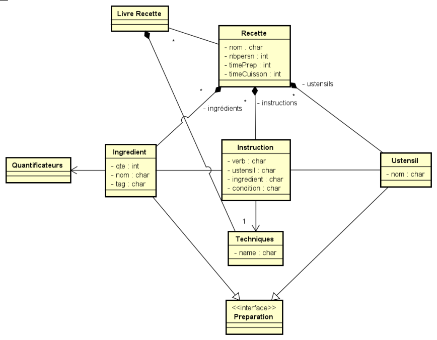

Pour travailler avec git, quand une version est récupérée:
- cuisine.recipe -> create a new folder 'src-gen' -> Clean all projects
- Project -> Clean
- cuisine.recipe -> src -> cuisine.recipe -> GenerateRecipe.mwe2 -> Run as

Les tests doivent fonctionner

# Modèle : 

Déclaration de techniques

{
Nom recette

Optionnel : Description

Optionnel : Temps de préparation, cuisson

Référence Nombre de personnes

Ingrédients
- Maybe : ajouter groupes
- [qte] nom_de_l'ingrédient #group

Ustensiles (récipients, outils, appareil (=bout de la préparation), etc.): 
- nom_ustensile1
- nom_ustensile2
- ...

Instructions : 
- [nom] verbe [ingredient(s)] ustensile [condition]
- ou : [nom] instruction1, instruction2, instruction3... (qui font référence au(x) même ingrédient(s))
}

Unités (https://en.wikipedia.org/wiki/Cooking_weights_and_measures)
- g
- L
- càc / tsp
- cas / tbsp
- pots de yaourt
- verre
- livres
- pas d'unité
- Du
- ...

# Exemple de Recette : 

## Gaufres Trotro (lardons, Cheddar et p’tits oignons)

Matos : un fouet et un gaufrier

Timing : le temps de cuire les lardons et les gaufres

Ingrédients (pour une petite dizaine)
- 100g de lardons fumés
- 140g de farine t55
- 1/2 cc de bicarbonate (1/4 tsp)
- 1 petite cc de levure chimique (1/2 tsp)
- 1 cc de sel marin (3/4 tsp)
- 1 cs de sucre (1 tbsp)
- 1 petite cc de paprika fumé piquant (ou paprika fumé doux + une pointe de poivre de cayenne)
- 1 1/2 œuf à température ambiante (voir note)
- 240g de buttermilk, lait fermenté, lait ribot (ou d’un mélange maison, voir note), à température ambiante
- 15g de beurre fondu
- 1 cs de graisse des lardons cuits
- 100g de Cheddar râpé
- 4 p’tits oignons émincés (sauf le vert foncé)
- Un œuf frit
- Du sirop d’érable
Pcq #YOLO

Notes :
1. Pour compter un œuf et demi, casse 1 œuf dans un bol posé sur une balance, bats-le légèrement pour mélanger blanc et jaune et garde 30g d’œuf. Ou double la recette!
2. Pour une version vg, tu peux remplacer les lardons par 2 cc de paprika fumé (et la graisse de lardons par 15g de beurre supplémentaire).
3. Tu peux remplacer le Cheddar par un fromage à pâte dure, si possible un avec du goût (évite l’emmental).
4. Les P’tits oignons sont pour moi ici indispensables, pour leur croustillant et surtout le contraste et le peps qu’ils apportent. Tu peux essayer de les remplacer par un petit oignon rouge très finement émincé (je n’ai pas testé) ou des cornichons.
5. Pour le buttermilk, tu peux simplement faire un mélange moitié lait entier moitié yaourt entier, avec 1 cuillère à soupe de jus de citron, en laissant reposer 10 minutes. Ou utiliser du kéfir.
Krrrrrrrrrkrr

## Transformation
    1.Fais griller les lardons dans une grande poêle jusqu’à ce qu’ils soient bien dorés et croustillants.
    griller [poele] ingrédient(s) => condition
    
    Coupe-les en petits morceaux.
    couper ingredient(s) petits
    
    Réserve 1 cs de graisse de lardons à ajouter aux ingrédients liquides.
    réserver ingrédients(s) (étape | commentaire)
    
    Fais chauffer ton gaufrier.
    Chauffer ustensile
    
    2. Dans un petit bol, mélange tous les ingrédients secs à l’aide d’un fouet.
    Mélanger [outil] ingrédients [récipient]
    
    3. Dans un grand bol, mélange les ingrédients liquides.
    Mélanger [outil] ingrédients [récipient]
    
    4. Verse les ingrédients secs dans les ingrédients liquides
    Verser ingrédients [qté] [outil] (ingrédients | préparation | ustensile avec conditions dessus)
    
    mélange au fouet, en t’arrêtant dès qu’il n’y a plus de traces de farine. 
    pate = Mélanger [outil] ingrédients [récipient] => condition
    
    Répartis lardons, Cheddar et oignons dans la pâte.
    pate = Répartir ingrédients (ingrédient | préparation|ustensile)
    
    5. Verse une petite louche de pâte dans chaque cavité de ton gaufrier très chaud et graissé (attention que les lardons ne restent pas au fond du bol). 
    Verser ingrédients [qté] [outil] (ingrédients | préparation|ustensile avec conditions desus)
    
    Cuits jusqu’à obtenir des gaufres dorées et fondantes.
    Cuire ingrédients condition
    
    Réserve au four préchauffé à 100 degrés, le temps de tout cuire, ou sers immédiatement.
    Choix:
    - Mettre_au_four température condition
    - servir
    
    Surmonté d’un œuf frit oui, 
    
    dégoulinant de sirop d’érable, hell yeah.
    
    See you soon, little spoon…!

## EXEMPLE avec métamodèle
    // Déclaration de techniques
    
    define grill [utensil] ingredient
    define grease [ustensil]
    define cut [tool] ingredient {{small, medium, large}, {cubes, slices, bits}}
    define reserve ingredient comment
    define heat ustensil [temperature]
    define mix [ustensil] ingredient [preparation]
    define pour ingredient [ustensil] [preparation]
    define distribute ingredient preparation
    define cook ingredient [ustensil]
    define put_in ingredient [ustensil]
    
    // Recette(s)
    recipe {
        name : Gaufres Trotro (lardons, Cheddar et p’tits oignons)
    
        time : 15m 2m
    
        nb_pers : 9.5
        
        ingredients {
            Lardons Fumés : 100g @lardons
            Farine t55 : 140g #sec @farine
            Bicarbonate : 0.5càc #sec
            Levure chimique : 0.8càc #sec @levure
            Sel marin : 1càc #sec @sel
            Sucre : 1càs #sec
            Paprika fumé piquant : 1càc #sec @paprika
            Oeuf : 1.5 #liquide
            Buttermilk du cul : 240g #liquide @lait
            Beurre fondu : 15g #liquide @beurre
            Graisse des lardons cuits : 1càc #liquide @graisseLC
            Cheddar rapé : 100g @cheddar
            Petits oignons émincés : 4 @oignons
            Oeuf frit : 1 #aled
            Sirop d'érable : any #aled
        }
        
        ustensils {
            Poele
            Gauffrier
            Fouet
            Grand bol
            Petit bol
            Louche
            Four
        }
        
        instructions {
            grill Poele Lardons Fumés "Biens dorés et croustillants"
            cut Lardons Fumés small bits -> lardons
            reserve Graisse des lardons cuits (1càs) "A ajouter aux ingrédients liquides"
            
            heat Gaufrier -> Gaufrier chaud
            
            mix Fouet #sec Petit bol
            mix #liquide Grand bol
            pour #sec #liquide -> pate
            mix fouet pate "Plus de trace de farine"
            distribute lardons Cheddar Petits Oignons émincés, pate
            
            grease Gaufrier chaud -> Gaufrier chaud et graissé
            pour pate Louche Gaufrier chaud et graissé -> Gaufre
            cook Gaufre "Dorées et fondantes"
            
            END
        }
    }
# Métamodèle 

